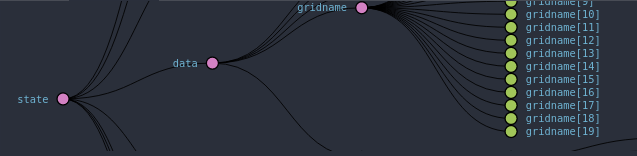
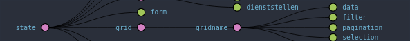

# wikom-data
#1. Introduction
##1.1 What is wikom-data?
As  the  name  suggests,  wikom-data  is  a  library  that  is  all  about  loading  data  from  an  API  endpoint.   Ittherefore provides the user with a React-Component called DataProvider, that is capable of loading datafrom an url and passing it to its children via props.  It is used in combination with Grids or Forms, thatare nested inside of the DataProvider component.  See Section 2 for some basic use cases.  It is capable ofhandling a lot of common needs, e.g.  the loading state.  The main conguration for the DataProvider are the"dataMap" and "dataProp" properties, which often are combined.  For more detail on each of the passableprops see Section 3.  For a more detailed code documentation see Section 4.

##1.2 Installation
Add wikom-data to your js project with yarn:

```javascript
yarn add git+https://github.com/Wikom/wikom-data.git
```

or with npm:

```javascript
npm install --save git+https://github.com/Wikom/wikom-data.git
```

You can also add the standalone build directly to your page. Download dist/index.js and add it to your html-page:

```html
<script src="path-to-your-downloaded-js-file"></script>
```

Remember to include all dependencies as well.
#2 Basic usage

To  load  data  into  a  grid  you  only  need  to  nest  the  grid  within  a  DataProvider  tag  and  set  the  neededproperties of the Dataprovider.  You need to set the url and also you need to name the dataprovider, butyou can just give it the same name as the grid itself.  The url obviously tells the DataProvider where to getthe data from, while the name tells it where to store the data in the store.  You might also want to look atthe ConnectedGrid class provided in wikom-grid for this use case.  See Listing 1 for a basic example.
#####Listing 1: Basic DataProvider and Grid usage
```html
<DataProvider name="gridname" url="/api/url">
    <Grid name="gridname" [...]>
        [...]
    </Grid>
</DataProvider>
```
This code generates the following structure in the store, where gridname[i] represents the i-th object provided by the API.



There is already a special class for this common use case, which you might want to use.  See Listing 2 for anexample.  Notice that the url property is called "baseUrl" in the connectedGrid, and the name property isgrid, which needs to be the same name as the name of the grid.

#####Listing 2: The "ConnectedGrid"
```html
<ConnectedGrid grid="gridname" baseUrl="/api/url">
    <Grid name="gridname">
    </Grid>
</ConnectedGrid>
```

This generates a similar structure in the store, where the data eld holds the objects returned from the API.



The DataProvider can be used the same way to load values from an endpoint into a form.  See Listing 3 foran example.

#####Listing 3: Basic DataProvider and Form usage
```html
<DataProvider name="formname" baseUrl={apiEndpoints.task}>
    <Form name="formname">
    </Form>
</DataProvider>
```

#3 passable properties
##3.1 The "name" property
Always needs to be set.  Determines where to store and nd the data in the store.  See Section 2 for examples.
##3.2 The "url" property
Always needs to be set.  Determines where to load the data from (API url).  See Section 2 for examples.
##3.3 The "dataProp" property
If your child components expects the data to be passed in a special property (other than the default dataprop) you can set the dataProp property of the Dataprovider to point to that property.Listing 4 shows an example.

#####Listing 4: "dataProp" property
```html
<DataProvider name="gridname" url="/api/url" dataProp="options">
    <Kombi [...]>
        [...]
    </Kombi>
</DataProvider>
```
##3.4 The "dataMap" property
If you need renaming of certain elds in your data you can pass a map function to the dataMap property.You might want to look at the javascript own Array.map() function if you are not familiar with it.Listing 5 shows an example.

#####Listing 5: "dataMap" property
```html
<DataProvider name="gridname" 
              url="/api/url" 
              dataProp="options" 
              dataMap={
                function callback(currentValue, index, array) {
                    // Return elementfornew_array   
                }
              }
>
    <Kombi [...]>
        [...]
    </Kombi>
</DataProvider>
```
##3.5 The "force" property
This  property  forces  the  DataProvider  to  reload  data  on  every  rerender,  if  set  to  true.   This  should  beavoided, if needed to use, use it with a function that only returns true under certain conditions.Listing 6 shows an example.

#####Listing 6: "force" property
```html
var dataHasChanged = true;
[...]
<DataProvider name="gridname" 
              url="/api/url" 
              dataProp="options"
              force={
                function callback(){ 
                    return dataHasChanged; 
                }
              }
>
    <Kombi [...]>
    [...]
    </Kombi>
</DataProvider>
```
This property is used to hide the children of the dataprovider as long as the data is not loaded.  Insteadit will show the "Loading" class.  The "isLoading" property is a internal property that is used with this."isLoading" should not be set from the outside.Listing 7 shows an example.

#####Listing 7: "onlyLoaded" property
```html
<DataProvider 
    name="task" 
    url={apiEndpoints.task + ’/’ +id}
    force={true}
    dataProp="initialValues"
    onlyLoaded={true}
>
    <WrapperContainer formmode="edit"/>
</DataProvider>;
```

#4 Code Documentation
## Modules

<dl>
<dt><a href="#module_actions/actionTypes">actions/actionTypes</a></dt>
<dd></dd>
<dt><a href="#module_actions/index">actions/index</a></dt>
<dd></dd>
<dt><a href="#module_middleware/ajaxErrorMiddleware">middleware/ajaxErrorMiddleware</a></dt>
<dd></dd>
<dt><a href="#module_reducers/dataReducer">reducers/dataReducer</a></dt>
<dd></dd>
<dt><a href="#module_reducers/errorReducer">reducers/errorReducer</a></dt>
<dd></dd>
<dt><a href="#module_reducers/queriesReducer">reducers/queriesReducer</a></dt>
<dd></dd>
<dt><a href="#module_reducers/userReducer">reducers/userReducer</a></dt>
<dd></dd>
</dl>

## Classes

<dl>
<dt><a href="#AppError">AppError</a></dt>
<dd><p>This is the main component for the graphical errors shown as soon as a javascript error occurs.</p>
</dd>
<dt><a href="#DataProvider">DataProvider</a></dt>
<dd><p>This is the main component.  It is responsible for loading the data into its children (passing it via props),also it handles the loading bar.
It is not responsible for loading the data into the state, nor is it responsiblefor updating the data in the state, although it might call the
loadData action responsible for loading data.</p>
</dd>
</dl>

<a name="module_actions/actionTypes"></a>

## actions/actionTypes

* [actions/actionTypes](#module_actions/actionTypes)
    * _static_
        * [.LOAD_DATA_PENDING](#module_actions/actionTypes.LOAD_DATA_PENDING) : <code>string</code>
        * [.LOAD_DATA_SUCCESS](#module_actions/actionTypes.LOAD_DATA_SUCCESS) : <code>string</code>
        * [.LOAD_DATA_FAILURE](#module_actions/actionTypes.LOAD_DATA_FAILURE) : <code>string</code>
        * [.LOAD_DATA_CANCEL](#module_actions/actionTypes.LOAD_DATA_CANCEL) : <code>string</code>
        * [.LOAD_DATA_PROGRESS](#module_actions/actionTypes.LOAD_DATA_PROGRESS) : <code>string</code>
        * [.CLEAR_DATA](#module_actions/actionTypes.CLEAR_DATA) : <code>string</code>
        * [.REFRESH_DATA](#module_actions/actionTypes.REFRESH_DATA) : <code>string</code>
        * [.SET_PAGINATION](#module_actions/actionTypes.SET_PAGINATION) : <code>string</code>
        * [.CLEAR_PAGINATION](#module_actions/actionTypes.CLEAR_PAGINATION) : <code>string</code>
        * [.SET_USER](#module_actions/actionTypes.SET_USER) : <code>string</code>
    * _inner_
        * [~PREFIX](#module_actions/actionTypes..PREFIX) : <code>string</code>

<a name="module_actions/actionTypes.LOAD_DATA_PENDING"></a>

### actions/actionTypes.LOAD_DATA_PENDING : <code>string</code>
Action type for pending ajax requests

**Kind**: static constant of [<code>actions/actionTypes</code>](#module_actions/actionTypes)  
<a name="module_actions/actionTypes.LOAD_DATA_SUCCESS"></a>

### actions/actionTypes.LOAD_DATA_SUCCESS : <code>string</code>
Action type for successfull ajax requests

**Kind**: static constant of [<code>actions/actionTypes</code>](#module_actions/actionTypes)  
<a name="module_actions/actionTypes.LOAD_DATA_FAILURE"></a>

### actions/actionTypes.LOAD_DATA_FAILURE : <code>string</code>
Action type for ajax requests that fail on server side

**Kind**: static constant of [<code>actions/actionTypes</code>](#module_actions/actionTypes)  
<a name="module_actions/actionTypes.LOAD_DATA_CANCEL"></a>

### actions/actionTypes.LOAD_DATA_CANCEL : <code>string</code>
Action type for ajax requests that fail on client side

**Kind**: static constant of [<code>actions/actionTypes</code>](#module_actions/actionTypes)  
<a name="module_actions/actionTypes.LOAD_DATA_PROGRESS"></a>

### actions/actionTypes.LOAD_DATA_PROGRESS : <code>string</code>
Action type for progress response

**Kind**: static constant of [<code>actions/actionTypes</code>](#module_actions/actionTypes)  
<a name="module_actions/actionTypes.CLEAR_DATA"></a>

### actions/actionTypes.CLEAR_DATA : <code>string</code>
Action type for clearing data from store

**Kind**: static constant of [<code>actions/actionTypes</code>](#module_actions/actionTypes)  
<a name="module_actions/actionTypes.REFRESH_DATA"></a>

### actions/actionTypes.REFRESH_DATA : <code>string</code>
ACtion type for refreshing data in store

**Kind**: static constant of [<code>actions/actionTypes</code>](#module_actions/actionTypes)  
<a name="module_actions/actionTypes.SET_PAGINATION"></a>

### actions/actionTypes.SET_PAGINATION : <code>string</code>
Action type to set pagination for next call

**Kind**: static constant of [<code>actions/actionTypes</code>](#module_actions/actionTypes)  
<a name="module_actions/actionTypes.CLEAR_PAGINATION"></a>

### actions/actionTypes.CLEAR_PAGINATION : <code>string</code>
Action type to clear pagination before next call

**Kind**: static constant of [<code>actions/actionTypes</code>](#module_actions/actionTypes)  
<a name="module_actions/actionTypes.SET_USER"></a>

### actions/actionTypes.SET_USER : <code>string</code>
Action type to set app user

**Kind**: static constant of [<code>actions/actionTypes</code>](#module_actions/actionTypes)  
<a name="module_actions/actionTypes..PREFIX"></a>

### actions/actionTypes~PREFIX : <code>string</code>
Prefix for all actions defined in this module

**Kind**: inner constant of [<code>actions/actionTypes</code>](#module_actions/actionTypes)  
<a name="module_actions/index"></a>

## actions/index

* [actions/index](#module_actions/index)
    * _static_
        * [.setUser](#module_actions/index.setUser)
        * [.loadDataPending](#module_actions/index.loadDataPending)
        * [.loadDataSuccess](#module_actions/index.loadDataSuccess)
        * [.loadDataFailure](#module_actions/index.loadDataFailure)
        * [.loadDataCancel](#module_actions/index.loadDataCancel)
        * [.loadDataProgress](#module_actions/index.loadDataProgress)
        * [.clearData](#module_actions/index.clearData)
        * [.refreshData](#module_actions/index.refreshData)
        * [.setPagination](#module_actions/index.setPagination)
        * [.clearPagination](#module_actions/index.clearPagination)
        * [.loadData](#module_actions/index.loadData) ⇒ <code>Promise</code>
        * [.download](#module_actions/index.download) ⇒ <code>Promise</code>
        * [.submit](#module_actions/index.submit) ⇒ <code>Promise</code>
        * [.directDelete](#module_actions/index.directDelete)
        * [.confirmAndDelete](#module_actions/index.confirmAndDelete)
    * _inner_
        * [~executeDelete(url)](#module_actions/index..executeDelete) ⇒ <code>Promise</code>

<a name="module_actions/index.setUser"></a>

### actions/index.setUser
Action to dispatch if the app user should change

**Kind**: static constant of [<code>actions/index</code>](#module_actions/index)  

| Param | Type | Description |
| --- | --- | --- |
| user | <code>object</code> | the new user |

<a name="module_actions/index.loadDataPending"></a>

### actions/index.loadDataPending
Action to dispatch as soon as an ajax request has started and is not finished

**Kind**: static constant of [<code>actions/index</code>](#module_actions/index)  

| Param | Type | Description |
| --- | --- | --- |
| name | <code>string</code> | The name of the request (to determine where to store in store) |
| url | <code>string</code> | The url for the request |

<a name="module_actions/index.loadDataSuccess"></a>

### actions/index.loadDataSuccess
Action to dispatch as soon as an api request finishes successfully

**Kind**: static constant of [<code>actions/index</code>](#module_actions/index)  

| Param | Type | Description |
| --- | --- | --- |
| name | <code>string</code> | The name of the request (to determine where to store in store) |
| url | <code>string</code> | The url for the request |
| data | <code>object</code> | The data that was returned by the server |

<a name="module_actions/index.loadDataFailure"></a>

### actions/index.loadDataFailure
Action to dispatch as soon as an api request failes on serverside

**Kind**: static constant of [<code>actions/index</code>](#module_actions/index)  

| Param | Type | Description |
| --- | --- | --- |
| name | <code>string</code> | The name of the request (to determine where to store in store) |
| url | <code>string</code> | The url for the request |
| error | <code>string</code> | The error that was returned by the server |

<a name="module_actions/index.loadDataCancel"></a>

### actions/index.loadDataCancel
Action to dispatch as soon as an api request fails on clientside

**Kind**: static constant of [<code>actions/index</code>](#module_actions/index)  

| Param | Type | Description |
| --- | --- | --- |
| name | <code>string</code> | The name of the request |
| url | <code>string</code> | The url of the request |

<a name="module_actions/index.loadDataProgress"></a>

### actions/index.loadDataProgress
Action to dispatch on progress message from server

**Kind**: static constant of [<code>actions/index</code>](#module_actions/index)  

| Param | Type | Description |
| --- | --- | --- |
| name | <code>string</code> | The name of the request |
| url | <code>string</code> | the url of the request |
| percent | <code>float</code> | the percentage of completion |

<a name="module_actions/index.clearData"></a>

### actions/index.clearData
Action to dispatch if the "name" part of the store is to be cleared

**Kind**: static constant of [<code>actions/index</code>](#module_actions/index)  

| Param | Type | Description |
| --- | --- | --- |
| name | <code>string</code> | the name of the part of the store that is to be cleared |

<a name="module_actions/index.refreshData"></a>

### actions/index.refreshData
Action to dispatch if the "name" part of the store is to be refreshed

**Kind**: static constant of [<code>actions/index</code>](#module_actions/index)  

| Param | Type | Description |
| --- | --- | --- |
| name | <code>string</code> | the name of the part of the store that is to be refreshed |

<a name="module_actions/index.setPagination"></a>

### actions/index.setPagination
Action to dispatch if the next request with "name" is to be paginated (or change in pagination)

**Kind**: static constant of [<code>actions/index</code>](#module_actions/index)  

| Param | Type | Description |
| --- | --- | --- |
| name | <code>string</code> | the name of the request |
| data | <code>object</code> | the configuration of the pagination |

**Example**  
```js
{
  pagination{
     "tasks": {
       "currentPage": 1,
       "pageCount": 0,
       "perPage": 20,
       "totalCount": 0
     }
   }
 }
```
<a name="module_actions/index.clearPagination"></a>

### actions/index.clearPagination
Action to dispatch if the "next request with name"s pagination should be cleared

**Kind**: static constant of [<code>actions/index</code>](#module_actions/index)  

| Param | Type | Description |
| --- | --- | --- |
| name | <code>string</code> | the name of the request |

<a name="module_actions/index.loadData"></a>

### actions/index.loadData ⇒ <code>Promise</code>
Action to dispatch to load data from an url into the store

**Kind**: static constant of [<code>actions/index</code>](#module_actions/index)  

| Param | Type | Description |
| --- | --- | --- |
| name | <code>string</code> | the name where to store the data |
| url | <code>string</code> | the url to send the request |

<a name="module_actions/index.download"></a>

### actions/index.download ⇒ <code>Promise</code>
Action to start a file download with progress information

**Kind**: static constant of [<code>actions/index</code>](#module_actions/index)  

| Param | Type | Description |
| --- | --- | --- |
| name | <code>string</code> | the name of the request |
| url | <code>string</code> | the url of the file to download |

<a name="module_actions/index.submit"></a>

### actions/index.submit ⇒ <code>Promise</code>
Action to submit data to an endpoint. Sends a put or post request depending on wether the datas primaryKey attribute is set or not.

**Kind**: static constant of [<code>actions/index</code>](#module_actions/index)  

| Param | Type | Description |
| --- | --- | --- |
| url | <code>string</code> | the url to submit to |
| data | <code>object</code> | the data to submit |
| primaryKey | <code>string</code> | the primaryKey attributes name in the data, defaults to id |

<a name="module_actions/index.directDelete"></a>

### actions/index.directDelete
Sends a direct delete request to an endpoint

**Kind**: static constant of [<code>actions/index</code>](#module_actions/index)  

| Param | Type | Description |
| --- | --- | --- |
| url | <code>string</code> | the url to send the delete to |
| refresh | <code>string</code> | the name of the part of the store that should be refreshed afterwards |

<a name="module_actions/index.confirmAndDelete"></a>

### actions/index.confirmAndDelete
Pops up an js-alert before deleting if confirmed

**Kind**: static constant of [<code>actions/index</code>](#module_actions/index)  

| Param | Type | Description |
| --- | --- | --- |
| url | <code>string</code> | the url to send the delete request |
| refresh | <code>string</code> | the name of the part of the store that should be refreshed afterwards |
| message | <code>string</code> | The message to be shown in the alert, defaults to 'Sind Sie sicher, dass Sie diesen Eintrag löschen möchten?' |

<a name="module_actions/index..executeDelete"></a>

### actions/index~executeDelete(url) ⇒ <code>Promise</code>
Sends an delete request to a server

**Kind**: inner method of [<code>actions/index</code>](#module_actions/index)  

| Param | Type | Description |
| --- | --- | --- |
| url | <code>string</code> | the url to send the request to |

<a name="module_middleware/ajaxErrorMiddleware"></a>

## middleware/ajaxErrorMiddleware
<a name="module_middleware/ajaxErrorMiddleware..ajaxErrorMiddleware"></a>

### middleware/ajaxErrorMiddleware~ajaxErrorMiddleware(target, store, next, action) ⇒ <code>function</code>
Middleware that changes the href of the current window/tab if an 401 unauthorized Response is received.

**Kind**: inner method of [<code>middleware/ajaxErrorMiddleware</code>](#module_middleware/ajaxErrorMiddleware)  
**Returns**: <code>function</code> - next applied to action  
**Category**: middleware  

| Param | Type | Description |
| --- | --- | --- |
| target | <code>string</code> | the url to redirect to |
| store | <code>object</code> | the app store |
| next | <code>function</code> | the next middleware |
| action | <code>objecŧ</code> | the action to be dispatched |

<a name="module_reducers/dataReducer"></a>

## reducers/dataReducer
<a name="module_reducers/dataReducer..dataReducer"></a>

### reducers/dataReducer~dataReducer(reducers) ⇒ <code>object</code>
The data reducer is the reducer that handles all data and pagination actions (except LOAD_DATA_FAILURE,which gets handled by the errorReducer).
It sets or unsets the data storing part in the store.  The name of the action determines that part in the store

**Kind**: inner method of [<code>reducers/dataReducer</code>](#module_reducers/dataReducer)  
**Returns**: <code>object</code> - the next state  
**Access**: public  

| Param | Type | Description |
| --- | --- | --- |
| reducers | <code>function</code> | additional reducers to be called after this |

<a name="module_reducers/errorReducer"></a>

## reducers/errorReducer
<a name="module_reducers/errorReducer..errorReducer"></a>

### reducers/errorReducer~errorReducer(state, action) ⇒ <code>array</code>
Handles failure cases (LOAD_DATA_FAILURE and LOCATION_CHANGE).
If LOAD_DATA_FAILURE, it concats an error to the store, which then gets displayed in the AppErrorComponent
If LOCATION_CHANGE, it emptys the current store.

**Kind**: inner method of [<code>reducers/errorReducer</code>](#module_reducers/errorReducer)  
**Returns**: <code>array</code> - The new state after performing the action  
**Access**: public  

| Param | Type | Description |
| --- | --- | --- |
| state | <code>array</code> | The current state |
| action | <code>object</code> | The dispatched action |

<a name="module_reducers/queriesReducer"></a>

## reducers/queriesReducer
<a name="module_reducers/queriesReducer..queriesReducer"></a>

### reducers/queriesReducer~queriesReducer(state, action) ⇒ <code>object</code>
Handles  pending  data  requests  and  cancelation  of  such.   Also  handles  REFRESH_DATA,  CLEAR_DATA and LOAD_DATA_PROGRESS actions.
Sets internal properties of the state, that are used to determine thestate of the request (e.g.  isPending or percent).

**Kind**: inner method of [<code>reducers/queriesReducer</code>](#module_reducers/queriesReducer)  
**Returns**: <code>object</code> - the next state  
**Access**: public  

| Param | Type | Description |
| --- | --- | --- |
| state | <code>object</code> | the current state |
| action | <code>object</code> | the dispatched action |

<a name="module_reducers/userReducer"></a>

## reducers/userReducer
<a name="module_reducers/userReducer..userReducer"></a>

### reducers/userReducer~userReducer(state, action) ⇒ <code>Object</code>
Handles the SET_USER action.  Changes the user in the app state.

**Kind**: inner method of [<code>reducers/userReducer</code>](#module_reducers/userReducer)  
**Access**: public  

| Param | Type | Description |
| --- | --- | --- |
| state | <code>object</code> | the current state |
| action | <code>object</code> | the dispatched action |

<a name="AppError"></a>

## AppError
This is the main component for the graphical errors shown as soon as a javascript error occurs.

**Kind**: global class  
<a name="new_AppError_new"></a>

### new AppError(errors)
Constructs an AppError UI widget, that shows errors stored in the store.


| Param | Type | Description |
| --- | --- | --- |
| errors | <code>array</code> | the errors to be displayed |

<a name="AppError"></a>

<a name="DataProvider"></a>

## DataProvider
This is the main component.  It is responsible for loading the data into its children (passing it via props),also it handles the loading bar.
It is not responsible for loading the data into the state, nor is it responsiblefor updating the data in the state, although it might call the
loadData action responsible for loading data.

**Kind**: global class  

**Example**  
```html
const Inner = ({data}) => <span>{data}</span>;
<DataProvider name="demo" url="/api/demo">
    <Inner/>
</DataProvider>
```
